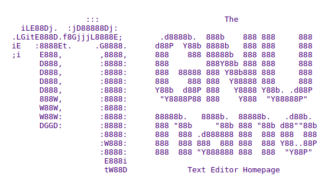
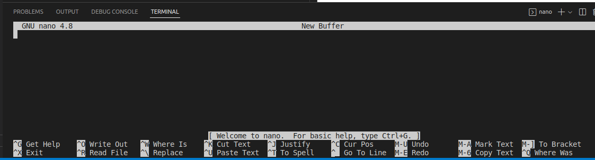

# Nano Editor



## Introdoction:

Nano is a small and simple text editor for use on the terminal.
    It copied the interface and key bindings of the Pico editor but
    added several missing features: undo/redo, syntax highlighting,
    line numbers, softwrapping, multiple buffers, selecting text by
    holding Shift, search-and-replace with regular expressions, and
    several other conveniences.
    ref.: https://www.nano-editor.org/dist/latest/README

> nano --version

 ```
 GNU nano, version 4.8
 (C) 1999-2011, 2013-2020 Free Software Foundation, Inc.
 (C) 2014-2020 the contributors to nano
 Email: nano@nano-editor.org    Web: https://nano-editor.org/
 Compiled options: --disable-libmagic --enable-utf8
 ```

nano

 

Some Commands:
- ^G = Get Help
- ^X = Exit
- ^O = Write Out
- ^R = Read File 

## Utilizations:

### Example:

Create new file

> nano text.txt

`
Writing something
`

- ^O 
- Enter
- ^X

